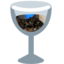

#  Vinegar

An open-source, minimal, [NOT]configurable, [TOTALLY REAL]fast bootstrapper for running Roblox on Linux

## statussssssssssss
workign!!!

roblox player fix 2024

# feturez
## [NEW]ROBLOX FIX OMG!!!

# hov 2 run robloc
patch binary with sed command
run installer and install.
go installed files and patch again
remove installer file and replace with empty file
replace ntdll.dll file from windows
set wine version as 7
run :D
or use the sh file in repo for a legit patched wine build!!!!

# join or no robluc
+ [Discord server](https://discord.gg/dzdzZ6Pps2)

# who r thez
+ Credits to
  + [ios7jbpro](https://github.com/ios7jbpro) for totally working rol workaround 2024
