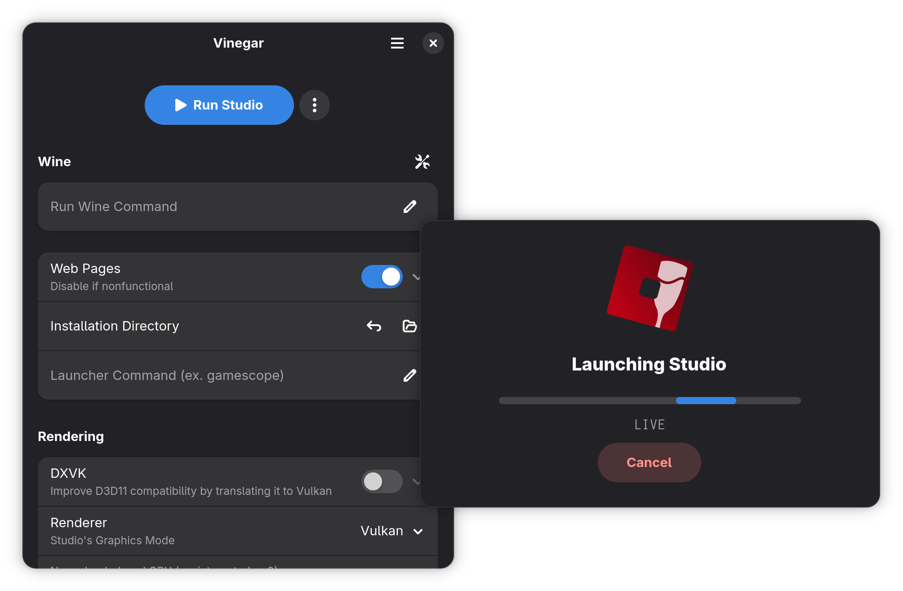

#  Vinegar

[![Pipeline Status][pipeline_img    ]][pipeline    ]
[![Version        ][version_img     ]][version     ]
[![Flathub        ][flathub_img     ]][flathub     ]
[![Report Card    ][goreportcard_img]][goreportcard]
[![Discord Server ][discord_img     ]][discord     ]

An open-source, configurable, fast bootstrapper for running Roblox Studio on Linux.

[pipeline]:     https://github.com/vinegarhq/vinegar/actions/workflows/build.yml
[pipeline_img]: https://img.shields.io/github/actions/workflow/status/vinegarhq/vinegar/build.yml?style=flat-square&label=build%20%26%20tests
[version]:     https://github.com/vinegarhq/vinegar/releases/latest
[version_img]: https://img.shields.io/github/v/release/vinegarhq/vinegar?style=flat-square&display_name=tag
[flathub]:     https://flathub.org/apps/details/org.vinegarhq.Vinegar
[flathub_img]: https://img.shields.io/flathub/downloads/org.vinegarhq.Vinegar?style=flat-square
[goreportcard]:     https://goreportcard.com/report/github.com/vinegarhq/vinegar
[goreportcard_img]: https://goreportcard.com/badge/github.com/vinegarhq/vinegar?style=flat-square
[discord]:     https://discord.gg/dzdzZ6Pps2
[discord_img]: https://img.shields.io/discord/1069506340973707304?style=flat-square&label=discord

# See Also
+ [Discord server][discord]
+ [Documentation](https://vinegarhq.github.io)
+ [Roblox-Studio-Mod-Manager](https://github.com/MaximumADHD/Roblox-Studio-Mod-Manager)
+ [Bloxstrap](https://github.com/pizzaboxer/bloxstrap)

# Acknowledgements
+ Credits to
  + [pizzaboxer](https://github.com/pizzaboxer)
  + [MaximumADHD](https://github.com/MaximumADHD)
